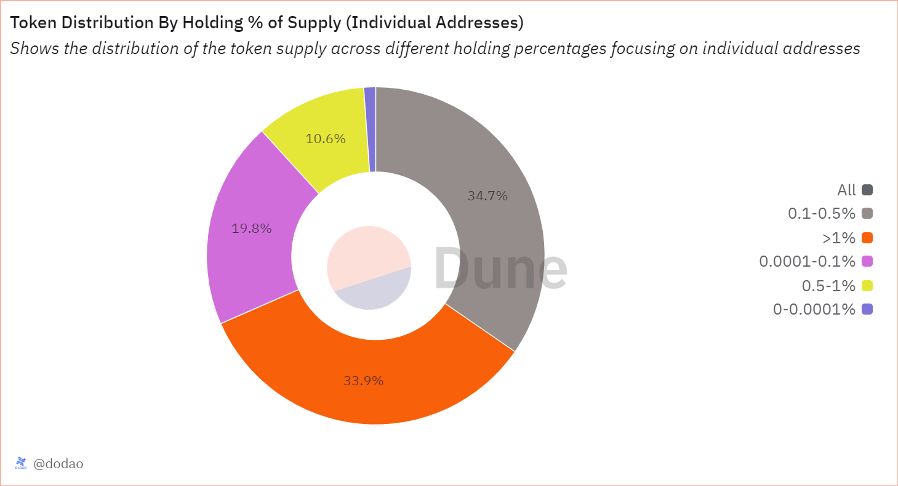

# About

This pie chart visualizes the distribution of token balances among holders based on predefined percentage ranges relative to the token's total supply. Each range (0-0.0001%, 0.0001-0.1%, 0.1-0.5%, 0.5-1%, >1%) represents a segment of holders by their token holdings, illustrating how the total supply is distributed across different holder categories.

# Graph



# Relevance

## Asset decentralization

It reveals the distribution of token holdings across a spectrum, indicating whether the token supply is concentrated among a few large holders or distributed more evenly among many small holders. A more decentralized distribution typically suggests a broader ownership base and potentially greater network resilience.

## Holder Categories

It categorizes holders based on their token balances, such as distinguishing between smaller retail holders (0-0.0001%, 0.0001-0.1%) and larger entities (0.1-0.5%, 0.5-1%, >1%). This categorization helps identify the proportion of tokens held by different types of entities, including retail investors, institutions, whales and possibly exchanges.

# Query Explanation

This query calculates the total token balances distributed across predefined percentage ranges (range) relative to the token's total supply. It first computes daily balances adjusted for token decimals and aggregates these into cumulative balances over time. Then, it categorizes these balances into specified percentage brackets (e.g., 0-0.0001%, 0.0001-0.1%, etc.) based on the token's total supply, ensuring non-null values are displayed in ascending order by range.

Retrieves the number of decimals for the specified token.

```sql
decimals_info_token AS (
    SELECT
      decimals
    FROM
      tokens.erc20
    WHERE
      contract_address = {{token_address}}
  )
```

Calculates the value of token transfers by normalizing them using the token's decimals. Includes both minting (transfers from the zero address) and burning (transfers to the zero address) events.

```sql
value_transfers_token AS (
    SELECT
      b.value / POWER(10, d.decimals) AS value
    FROM
      erc20_{{chain}}.evt_Transfer AS b
      INNER JOIN {{chain}}.transactions AS tx ON tx.hash = b.evt_tx_hash
      CROSS JOIN decimals_info_token d
    WHERE
      b.contract_address = {{token_address}}
      AND b."from" = 0x0000000000000000000000000000000000000000
    UNION ALL
    SELECT
      - d.value / POWER(10, e.decimals) AS value
    FROM
      erc20_{{chain}}.evt_Transfer AS d
      INNER JOIN {{chain}}.transactions AS tx ON tx.hash = d.evt_tx_hash
      CROSS JOIN decimals_info_token e
    WHERE
      d.contract_address = {{token_address}}
      AND d."to" = 0x0000000000000000000000000000000000000000
  )
```

Computes the total supply of the token by summing up all normalized transfer values.

```sql
token_total_supply AS (
    SELECT
      SUM(value) AS total_supply
    FROM
      value_transfers_token
  )
```

Aggregates daily token transfers, summing the amounts for each address and day.

```sql
token_transfers AS (
    SELECT
      DAY,
      address,
      token_address,
      SUM(amount) AS amount
    FROM
      (
        SELECT
          DATE_TRUNC('day', evt_block_time) AS DAY,
          "to" AS address,
          tr.contract_address AS token_address,
          CAST(value AS DECIMAL (38, 0)) AS amount
        FROM
          erc20_{{chain}}.evt_Transfer AS tr
        WHERE
          contract_address = {{token_address}}
        UNION ALL
        SELECT
          DATE_TRUNC('day', evt_block_time) AS DAY,
          "from" AS address,
          tr.contract_address AS token_address,
          (-1) * (CAST(value AS DECIMAL (38, 0))) AS amount
        FROM
          erc20_{{chain}}.evt_Transfer AS tr
        WHERE
          contract_address = {{token_address}}
      ) AS t
    GROUP BY
      1,
      2,
      3
  )
```

Calculates the running balance for each address over time.

```sql
token_balances_with_gap_days AS (
    SELECT
      t.day,
      address,
      SUM(amount) OVER (
        PARTITION BY
          address
        ORDER BY
          t.day
      ) AS balance,
      LEAD(DAY, 1, CURRENT_TIMESTAMP) OVER (
        PARTITION BY
          address
        ORDER BY
          t.day
      ) AS next_day
    FROM
      token_transfers AS t
  )
```

Generates a sequence of days for the current date.

```sql
days AS (
    SELECT
      DAY
    FROM
      UNNEST (
        SEQUENCE(
          TRY_CAST(DATE_TRUNC('day', CURRENT_TIMESTAMP) AS TIMESTAMP),
          CAST(
            TRY_CAST(
              TRY_CAST(
                TRY_CAST(DATE_TRUNC('day', CURRENT_TIMESTAMP) AS TIMESTAMP) AS TIMESTAMP
              ) AS TIMESTAMP
            ) AS TIMESTAMP
          ),
          INTERVAL '1' day
        )
      ) AS _u (DAY)
  )
```

Computes the balance for each address for each day, filling in the days between transfers.

```sql
token_balance_all_days AS (
    SELECT
      d.day,
      address,
      SUM(
        balance / TRY_CAST(POWER(10, di.decimals) AS DOUBLE)
      ) AS balance
    FROM
      token_balances_with_gap_days AS b
      INNER JOIN days AS d ON b.day <= d.day
      AND d.day < b.next_day
      CROSS JOIN decimals_info_token di
    GROUP BY
      1,
      2
    ORDER BY
      1,
      2
  )
```

This CTE categorizes token holders into specified percentage ranges based on their balances relative to the total_supply of the token (ts.total_supply). It calculates the sum of balances falling within each range using conditional aggregation.

```sql
token_balances_within_ranges AS (
    SELECT
      '0-0.0001%' AS range,
      SUM(
        CASE
          WHEN b.balance > 0
          AND b.balance <= ts.total_supply * 0.000001 THEN b.balance
        END
      ) AS balance
    FROM
      token_balance_all_days AS b
      CROSS JOIN token_total_supply ts
    WHERE
      b.balance > 0
    UNION ALL
    SELECT
      '0.0001-0.1%' AS range,
      SUM(
        CASE
          WHEN b.balance > ts.total_supply * 0.000001
          AND b.balance <= ts.total_supply * 0.001 THEN b.balance
        END
      ) AS balance
    FROM
      token_balance_all_days AS b
      CROSS JOIN token_total_supply ts
    WHERE
      b.balance > 0
    UNION ALL
    SELECT
      '0.1-0.5%' AS range,
      SUM(
        CASE
          WHEN b.balance > ts.total_supply * 0.001
          AND b.balance <= ts.total_supply * 0.005 THEN b.balance
        END
      ) AS balance
    FROM
      token_balance_all_days AS b
      CROSS JOIN token_total_supply ts
    WHERE
      b.balance > 0
    UNION ALL
    SELECT
      '0.5-1%' AS range,
      SUM(
        CASE
          WHEN b.balance > ts.total_supply * 0.005
          AND b.balance <= ts.total_supply * 0.01 THEN b.balance
        END
      ) AS balance
    FROM
      token_balance_all_days AS b
      CROSS JOIN token_total_supply ts
    WHERE
      b.balance > 0
    UNION ALL
    SELECT
      '>1%' AS range,
      SUM(
        CASE
          WHEN b.balance > ts.total_supply * 0.01 THEN b.balance
        END
      ) AS balance
    FROM
      token_balance_all_days AS b
      CROSS JOIN token_total_supply ts
    WHERE
      b.balance > 0
  )
```

Finally selects and displays token holder balance totals within predefined percentage ranges from the token_balances_within_ranges CTE, ensuring non-null values for balances and ordering results by range.

```sql
SELECT
  range,
  COALESCE(balance, 0) AS balance
FROM
  token_balances_within_ranges
ORDER BY
  range;
```

**Hardcoded addresses**

- [0x0000000000000000000000000000000000000000](https://etherscan.io/address/0x0000000000000000000000000000000000000000): This address is not owned by any user, is often associated with token burn & mint/genesis events and used as a generic null address

## Tables used

- tokens.erc20 (Curated dataset for erc20 tokens with addresses, symbols and decimals. Origin unknown)
- erc20\_{{Blockchain}}.evt_Transfer (Curated dataset of erc20 tokens' transactions. Origin unknown)

## Alternative Choices


